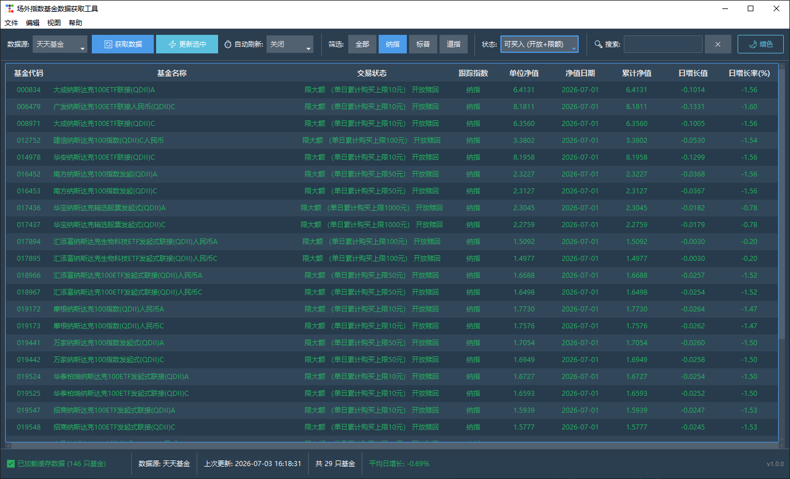

# 📈 场外指数基金多源数据监控工具

一款为投资者量身定制的现代化、多数据源的场外指数基金监控桌面应用程序。它可以帮助您实时追踪各大主要指数（如纳指、标普、道指等）相关的场外基金，并提供丰富的图表与交互功能，助力您把握交易时机。



## 🎯 详细功能列表

本软件提供了极其丰富的交互与数据分析功能，满足日常盯盘与定投的各种需求：

### 1. 核心数据与多源获取
- **多数据源无缝切换**：聚合了**天天基金**（默认）、**蚂蚁基金**以及**晨星数据**的接口，确保数据高可用。
- **自定义指数追踪**：在设置中支持通过关键词（如“纳斯达克”、“红利”）自定义追踪的场外指数基金。
- **后台异步静默刷新**：支持手动和**定时自动刷新**（如每5/10/30分钟），获取数据时进度条显示，主界面永不卡顿。

### 2. 强大的交互与浏览操作
- **双击直达内嵌网页**：采用 Edge Chromium 内核渲染，双击某只基金即可直接弹出独立的高清网页窗口，浏览基金深度详情，无需跳出应用或跳转默认浏览器。
- **历史净值可视化图表**：在基金上右键选择“查看历史净值图表”，即可调出过去30天的净值走势折线图，支持鼠标悬停查看数值和图表保存。
- **支持多选与右键菜单**：按住 `Ctrl` 或 `Shift` 点击，或者直接拖拽可同时选中多只基金；右键菜单提供专属操作入口。
- **“⚡ 更新选中” (局部极速刷新)**：再也不用为了几只基金重载几千条数据！选中特定的基金后，点击工具栏或右键菜单的“更新选中”，2秒内精准刷新所选基金的交易状态和净值。

### 3. 数据过滤与检索引擎
- **多词模糊搜索**：搜索框支持用**空格分词**（例如输入 `广发 纳指 A`），即可精准、模糊地找出名称中同时包含这些词的基金或代码。
- **交易状态多维过滤**：一键筛选“暂停赎回”、“限大额”等多种具体的交易限制状态，是决定今日能否加减仓的得力助手。
- **表头动态排序**：点击任意表头（如日增长率、单位净值），即可对当前列表进行升序/降序排列。

### 4. 极致现代化护眼 UI (防疲劳)
- **Superhero / Flatly 动态主题**：告别刺眼的纯黑！夜间模式采用专业金融终端都在用的深蓝灰（Superhero）色调，白天模式采用清新的扁平轻量（Flatly）色调，降低长久盯盘的视觉疲劳。
- **红涨绿跌与呼吸感排版**：符合中国股市习惯的涨跌着色，30px 拉宽行高，搭配暗色斑马纹自适应排版，坚决防止看错行。

### 5. 数据留存与分析
- **本地 SQLite 强缓存**：每次获取数据自动备份，下次启动程序秒开并加载最后一次的缓存数据。
- **一键导出为 Excel/CSV**：随时把当前筛选好、排序好的表格数据导出到本地，供更高级的表格分析工具使用。

## 📊 展示的基金核心数据维度

程序会自动从服务器抓取并清洗数据，最终为您在主界面表格中呈现以下核心指标：

1. **基金代码** (`code`)：唯一标识符。
2. **基金名称** (`name`)：完整的基金名称。
3. **交易状态** (`purchase_limit`)：当前该基金的交易限制状态，如“开放申购”、“暂停申购”、“暂停大额申购”等，极其适合用于筛选今日是否可买入。
4. **跟踪指数** (`index_type`)：根据您配置的关键词自动归类的所属指数标签。
5. **单位净值** (`nav`)：最新公布的单位净值。
6. **净值日期** (`nav_date`)：净值数据的最新归属日期。
7. **累计净值** (`acc_nav`)：反映基金成立以来的历史总收益表现。
8. **日增长值** (`daily_change`)：相较于上一交易日净值的绝对增减数值（红涨绿跌）。
9. **日增长率(%)** (`daily_change_pct`)：相较于上一交易日的涨跌幅度百分比。

## 🚀 快速开始

### 1. 环境准备

确保您的电脑上已经安装了 **Python 3.8+**，并且安装了以下核心依赖库：

```bash
pip install ttkbootstrap requests matplotlib pywebview
```
*(注：Windows 10/11 用户通常已自带 Edge WebView2，`pywebview` 可直接调起现代化内嵌网页)*

### 2. 运行程序

在项目根目录下，直接运行主入口文件即可：

```bash
python main.py
```

### 3. 操作指南

- **获取全市场数据**：首次打开程序，点击左上角的 `🔄 获取数据`，程序会从选定的数据源拉取所有您关注的指数基金。
- **配置专属指数关键词**：点击右上角 ⚙️ **编辑 -> 设置**。您可以在这里自定义您关注的指数提取关键词（如：输入 `纳指: 纳斯达克, 纳指`，并在保存后重新获取数据生效）。
- **多选与局部刷新**：
  - 按住键盘 `Ctrl` 或 `Shift` 键，用鼠标在表格中选中多只重点关注的基金。
  - 点击工具栏的 `⚡ 更新选中` 按钮，或者**直接在选中的基金上右击鼠标**并在右键菜单中选择更新，即可在 2 秒内单独刷出这几只基金的最新状态。
- **查看历史净值折线图**：
  - 在基金列表中**右击**任意一只基金，选择 `📈 查看历史净值图表`。
  - 弹出的图表窗口支持鼠标悬停查看每日具体数值，并能保存图表图片。
- **浏览网页级深度详情**：
  - **双击**任意一行基金，将立刻弹出一个现代化 Web 视窗，直接为您展示该基金在天天基金网上的全貌，方便查阅费率和重仓股。
- **数据导出与自动刷新**：
  - 您可以设置自动刷新频率（如每 5 分钟、30 分钟等）。
  - 支持随时将当前筛选后的表格数据一键导出为 **Excel** 或 **CSV** 格式。

## ⚙️ 架构说明

- `gui/`：基于 Tkinter + TtkBootstrap 构建的现代化响应式视图组件。
- `data_sources/`：抽象工厂模式设计的数据源拉取逻辑。
- `database.py`：基于 sqlite3 的轻量级本地数据引擎。
- `config.py`：全局状态、关键字配置与用户首选项管理。

## 🛠 开发与反馈

如果您发现某些基金无法获取、或者有增加新数据源（如雪球、同花顺）的需求，只需继承 `data_sources.base.BaseDataSource` 即可非常轻易地自行接入。期待您的改进！
